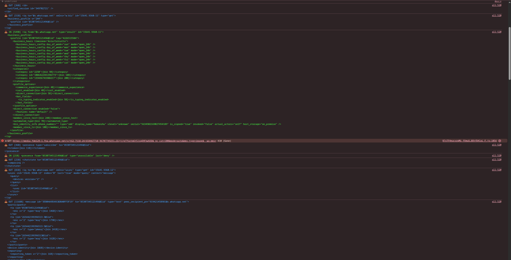

# Manipulating WhatsApp Web Traffic (for fun)

## Preamble

I was always that person who wanted to hide the read reciept of mine but still want to see if my message has been read by the other person.

> *How does WhatsApp Web actually send things like messages, typing indicators, or read receipts?*
> 

What’s actually going over the network?

---

## Step 1 — figuring out things

I opened DevTools and went straight to the **Network tab → WebSocket**.

Immediately, things looked… off.

Instead of clean JSON or protobuf-like structures, I saw:

- binary frames
- unreadable blobs
- no obvious structure

At this point, I tried a basic sanity check:

- Send `"a"`
- Send `"a".repeat(1000)`

And watched the frame sizes.

Frame size scaled with message length.

That told me two things:

1. Messages are being serialized client-side
2. Then encrypted before being sent

So the browser **must**:

- encode → encrypt → send
- receive → decrypt → decode

---

## Step 2 — the hook part

Instead of diving straight into obfuscated code (pain), I took a shortcut:

Hook the crypto.

Specifically:

```jsx
crypto.subtle.encrypt
crypto.subtle.decrypt
```

These are used by browsers for **AES-GCM**  which WhatsApp Web uses for transport encryption.

So I monkey-patched them.

```jsx
const realEncrypt = crypto.subtle.encrypt.bind(crypto.subtle);

crypto.subtle.encrypt = async function(algo, key, data) {
    console.log("Outgoing plaintext:", new Uint8Array(data));
    return realEncrypt(algo, key, data);
};
```

Same idea for `decrypt`.

---

## Step 3 — seeing the light in dark

Eureka moment here now…

Instead of random blobs, I started seeing structured data.

Not JSON.

Not protobuf.

Something else.

---

## Step 4 — The Weird Binary Format

The decrypted frames looked like compact trees.

After digging (and cross-referencing [open-source work](https://github.com/WhiskeySockets/Baileys)), I realized:

> WhatsApp uses a custom binary tree format — often referred to as **WABinary**
> 

It’s basically:

- tokenized strings (via lookup tables)
- compact node trees
- custom encoding for JIDs, lists, and attributes

Once you see it decoded, it looks like:

```xml
<message to="..." type="text">
  <enc>...</enc>
</message>
```

---

## Step 5 — Visualizing It

At this point, I built a small decoder.

And suddenly, traffic started looking like this:



> This is where things stop being “encrypted blobs” and start being *actual protocol messages*.
> 

You can see:

- `<message>`
- `<presence>`
- `<receipt>`
- `<chatstate>`

Which map almost directly to:

- messages
- online status
- read receipts
- typing indicators

---

## Step 6 — the manipulation

Once I could decode frames, the next obvious step was:

> What happens if I modify them?
> 

Instead of just logging decrypted data, I started intercepting outgoing frames *before encryption*.

Flow became:

```
App → plaintext → (my hook) → modify → encrypt → send
```

---

## Step 7 — First Manipulation: Read Receipts

Read receipts look like:

```xml
<receipt type="read" to="..." id="..." />
```

So I tried removing the `type="read"` attribute before sending.

```jsx
function stripType(node) {
    const newAttrs = {};
    for (const [k, v] of Object.entries(node.attrs)) {
        if (k !== 'type') newAttrs[k] = v;
    }
    return { tag: node.tag, attrs: newAttrs, content: node.content };
}
```

Result:

> ✅ Message gets delivered
> 
> 
> ❌ Blue tick never shows up
> 

---

## Step 8 — Expanding the Idea

At this point, it became a pattern:

| Feature | Protocol Node |
| --- | --- |
| Read receipts | `<receipt type="read">` |
| Played (voice notes) | `<receipt type="played">` |
| Typing | `<chatstate><composing /></chatstate>` |
| Presence | `<presence type="available" />` |

So instead of one-off hacks, I built a classifier layer:

```jsx
function isTypingIndicator(node) {
    return node.tag === 'chatstate' &&
        node.content?.some(c => c.tag === 'composing');
}
```

And then:

```jsx
if (flags.blockTyping && isTypingIndicator(node)) {
    return 'DROP';
}
```

---

## Step 9 — Full Traffic Manipulator

Eventually this turned into a full script that:

- Hooks encryption/decryption
- Decodes WABinary frames
- Classifies protocol messages
- Modifies or drops them
- Logs everything nicely

Example features:

- Hide read receipts
- Hide typing indicator
- Ghost mode (no online presence)

---

## Closing

---

This was purely a reverse-engineering exercise.

No exploitation, no bypassing encryption  just understanding how a modern web client communicates under the hood.

And honestly, that’s the fun part.

---

